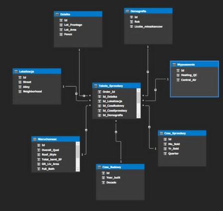
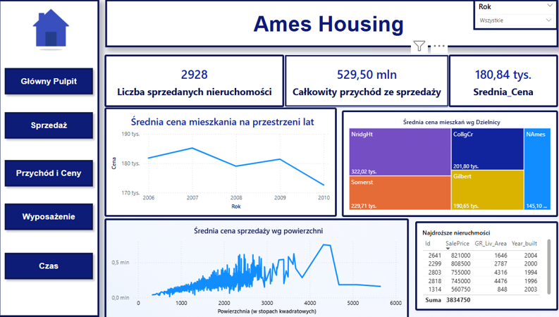
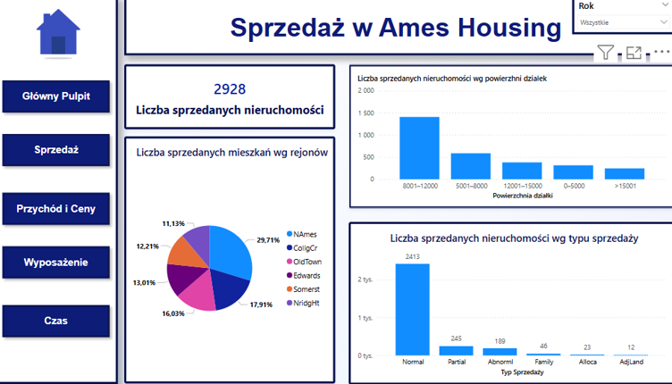
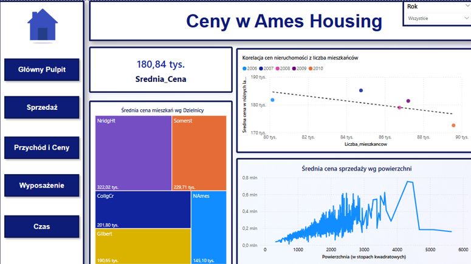
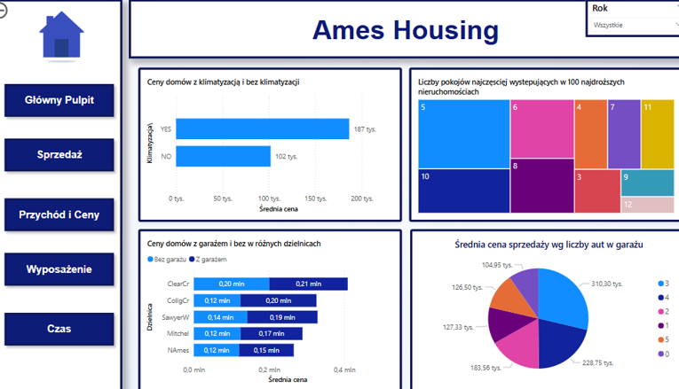
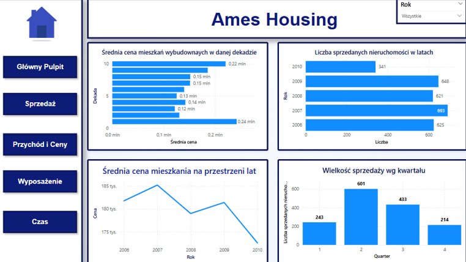

# 🏠 Ames Housing – Business Intelligence for the Real Estate Market
The project was developed by a two-person team as part of a university assignments for educational purposes.

This project analyzes single-family home sales in **Ames**, Iowa (USA), using data on property characteristics and **demographic information**. The goal was to build a complete **Business Intelligence solution** that supports decision-making for real estate developers, agencies, and local government through interactive dashboards and multidimensional analysis.

---

## 📊 System Architecture

- **Data sources**:
  - Property data CSV file from kaggle(https://www.kaggle.com/datasets/prevek18/ames-housing-dataset)
  - Demographic data from an external API
- **ETL process**: implemented in **Python**
  - **Extract**: read data from CSV and API
  - **Transform**: clean data (e.g., missing values, format normalization, categorization)
  - **Load**: insert data into a relational SQL Server database
- **Data model**: built using **SQL Server Analysis Services (SSAS Multidimensional)**
- **Visualization layer**: developed in **Power BI** as a dynamic management dashboard

---

## 🧱 Multidimensional Model – Star Schema

The data model follows a classic **star schema** design:

- **Fact table**: contains house sale transactions
- **Dimension tables**:
  - **Location** (e.g., `Neighborhood`, `Street`, `Alley`)
  - **Time** (e.g., `Year Built`, `Mo Sold`, `Yr Sold`)
  - **Property Features** (e.g., `Central Air`, `Garage Cars`, `Gr Liv Area`, etc.)
- All relationships are **one-to-many**

---

## 🔍 Sample OLAP Queries

The multidimensional cube enables interactive OLAP queries, such as:

1. **How do house prices compare between homes with and without garages across neighborhoods?**
2. **In which quarter did house sales peak?**
3. **Which areas of the city have the highest number of property transactions?**
4. **How does central air conditioning affect the sale price?**
5. **What is the correlation between population growth and housing prices?**

---

# Star Schema model

## 📈 Management Dashboards (Power BI)

Interactive Power BI dashboards were created for business users to explore key metrics and trends:

- 
- 
- 
- 
- 
---

## 🧩 Technologies Used

- Python (ETL and preprocessing)
- SQL Server (relational data warehouse)
- SQL Server Analysis Services (SSAS Multidimensional)
- Power BI (reporting and dashboards)
